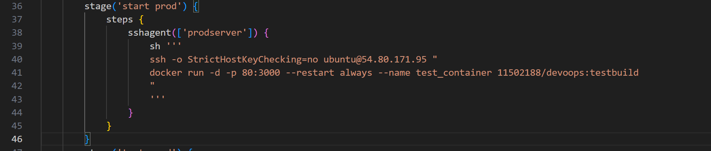

Vul onderstaande aan met de antwoorden op de vragen uit de readme.md file. Wil je de oplossingen file van opmaak voorzien? Gebruik dan [deze link](https://github.com/adam-p/markdown-here/wiki/Markdown-Cheatsheet) om informatie te krijgen over
opmaak met Markdown.

# test.jenkinsfile

Stage cleanup: we kijken of de image reeds bestaat, als deze aanwezig is verwijderen we de image. Hetzelfde voor de container.

Stage Install dependencies: we installeren de dependencies, npm.

Stage Build artifact: we bouwen de image met docker.build

Stage Push artifact: met behulp van de credentials van dockerhub pushen we de image naar de dockerhub van Fabian.

Stage deployment: hier doen we een docker pull om de latest image van dockerhub binnen te halen. Hierna wordt er een container gestart.

a) Om ervoor te zorgen dat Jenkins geen sudo nodig heeft om docker commando's uit te voeren, gebruik je volgend commando: 

# production.jenkinsfile

Stage deploy prod: we gebruiken SSH-Agent om een verbinding op te zetten met de production server om de latest image van dockerhub binnen te halen.

Stage start prod: we gebruiken SSH-Agent om een verbinding op te zetten met de production server om een docker container te starten op de laatste image die in de vorige stage werd binnengehaald.

Stage test prod: in deze stage testen we of de applicatie werkt door een curl te doen naar het IP adres van de production server.

Cleanup: we gebruiken SSH-Agent om een verbinding op te zetten met de production server om hierna te kijken of de image reeds bestaat, als deze aanwezig is verwijderen we de image. Hetzelfde voor de container.

